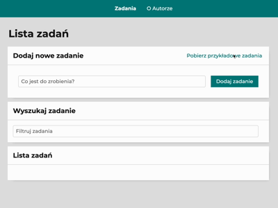

## What is this app?

Title is pretty self explanatory, you can add new tasks, mark existing tasks as done and remove them.
Looks like this:

Here it is: [Page](https://jamieshifter.github.io/todo-list-react/)

***

## Step by step

To add new task, simply write it in the top text field and click the submit button "Dodaj zadanie"

To remove an existing task - click the trash icon on the right of task you want to remove

To mark task as done, click the green button next to it, button should change to "✓" and text should now be striked through

To mark task as NOT done, click the green button next to it, button should change to plain and the striketrough should disappear from text

Whenever you decide that you want to mark all tasks as done - use the appropriate button "Ukończ wszystkie"

And if for some reason you decide to hide tasks that are done - use the "Ukryj ukończone", which you can revert any time

***

## Tech

- HTML(BEM compliant)
- CSS
- normalize.css
- google fonts
- JS(ES6 standard)
- React, hooks
- Webpack
- styled components

This project was bootstrapped with [Create React App](https://github.com/facebook/create-react-app).

## Available Scripts

In the project directory, you can run:

### `npm start`

Runs the app in the development mode.\
Open [http://localhost:3000](http://localhost:3000) to view it in your browser.

The page will reload when you make changes.\
You may also see any lint errors in the console.

### `npm run build`

Builds the app for production to the `build` folder.\
It correctly bundles React in production mode and optimizes the build for the best performance.

The build is minified and the filenames include the hashes.\
Your app is ready to be deployed!

See the section about [deployment](https://facebook.github.io/create-react-app/docs/deployment) for more information.

### `npm run eject`

**Note: this is a one-way operation. Once you `eject`, you can't go back!**

If you aren't satisfied with the build tool and configuration choices, you can `eject` at any time. This command will remove the single build dependency from your project.

Instead, it will copy all the configuration files and the transitive dependencies (webpack, Babel, ESLint, etc) right into your project so you have full control over them. All of the commands except `eject` will still work, but they will point to the copied scripts so you can tweak them. At this point you're on your own.

You don't have to ever use `eject`. The curated feature set is suitable for small and middle deployments, and you shouldn't feel obligated to use this feature. However we understand that this tool wouldn't be useful if you couldn't customize it when you are ready for it.